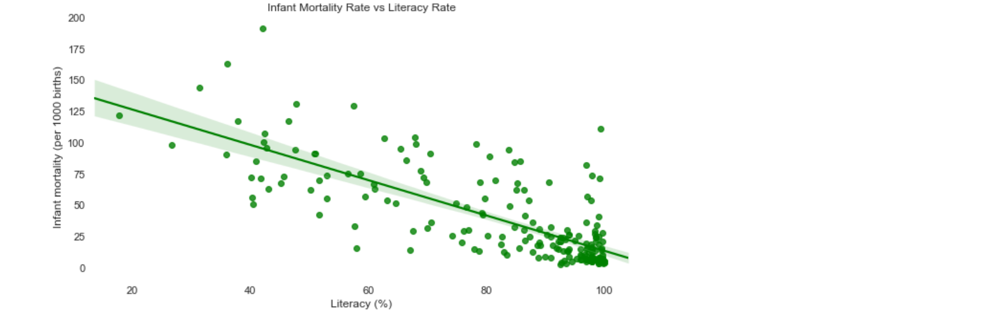

# Exploratory Data Analysis - World Statistics

## A. Goal
In this exercise, we will focus on making visualization more impactful through different types of charts and by working on their aesthetics and readability. The dataset contains information about different countries – such as population, area, GDP, and literacy.

Before we start visualizing data, we can have an initial look at our dataset and then clean it for visualization. The purpose of this exercise to provide a glimpse into how Python can be used to present information from a dataset in an easily digestible format.

## B. Data Source
https://www.kaggle.com/fernandol/countries-of-the-world

## C. Summary
_Data Cleaning_

1.	To deal with the missing data, we dropped the missing rows and the columns we were not focusing on.

2.	We viewed the summary of statistics, which had only 3 variables, but we were expecting to see other variables as well. The reason was that the other variables were not numerical.

3.	Hence, we converted those variables into numerical types and checked the datatypes again.

4.	Further, as we needed to use GeoJSON file to plot choropleth map, the entries in ‘Country’ and ‘Region’ columns had to be clean – without any unwanted space. We removed the spaces and checked the strings again.

_Exploratory Analysis_

1.	We used choropleth maps to show the literacy rates and infant mortality rates.

- Literacy Rates

- Infant Mortality Rates

Note: Some of the countries in the above two maps have a light shade, which does not depict a true value. Countries such as Ivory Coast and D.R.C (Congo) with have been removed during data cleaning or their names are not the same as in GeoJSON worldmap file.

2.	Correlation matrix provided us an easy view of the correlation between different numerical variables.

3.	The bar graph we used for showing the number of countries in each region is simple and yet conveys the required information. Here, our focus was on reducing clutter and improving readability.

4.	Finally, we created scatter plots.
- First one is GDP v Literacy, and it did not have a regression line

- Second plot is Infant Mortality v Literacy and has a regression line – showing the overall trend

- Third plot is a GDP vs Literacy bubble plot, with the size of the bubble indicating Infant Mortality rate. We can observe that as GDP and Literacy increases, the Infant Mortality Rate (bubble size) reduces.

